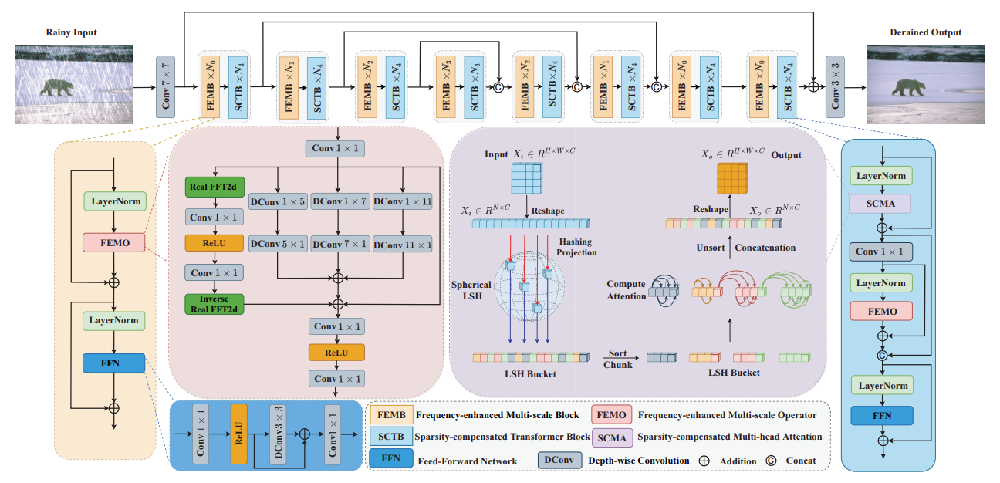

# Image Deraining Transformer with Sparsity and Frequency Guidance
[](https://doi.org/10.1109/ICME55011.2023.00324) 

[](https://drive.google.com/drive/folders/1KRR_L276nviPT9JFPL9zfBiZVKJO6dM1?usp=drive_link)
[](https://pan.baidu.com/s/1TlgoslD-hIzySDL8l6gekw?pwd=pu2t)

> **Abstract:** 
In recent years, Transformer has witnessed significant progress in the single image deraining field. 
However, most existing methods do not consider the latent sparse representation and distinguished frequency information.
To this end, this paper proposes an effective Image Deraining Transformer with Sparsity and Frequency Guidance, called SFG-IDT.
To achieve such guidance, the proposed method consists two key designs: sparsity-compensated multi-head attention (SCMA) and frequency-enhanced multi-scale operator (FEMO).
Specifically, the SCMA enhances the concentration of attention while explicitly retaining non-local connectivity with Locality Sensitive Hashing (LSH), to facilitate rain removal better and help image restoration.
Simultaneously, the FEMO integrates the frequency information into the multi-scale convolution operators with Fast Fourier Transform (FFT) to obtain a more accurate representation for achieving high-quality derained results.
Extensive experimental results show that our developed SFG-IDT outperforms the state-of-the-art approach (Restormer) by 0.27 dB on average, but saves 50.3% parameters and 46.7% computational cost.



## News
- **Sep 23, 2022:** We will release the code coming soon.
- **Aug 26, 2023:** [Paper](https://doi.org/10.1109/ICME55011.2023.00324) Online. 
- **Mar 13, 2023:** [Paper](https://doi.org/10.1109/ICME55011.2023.00324) accepted by IEEE ICME 2023. 

## Preparation

### Install

We test the code on PyTorch 1.9.1 + CUDA 11.1 + cuDNN 8.0.5.

1. Create a new conda environment
```
conda create -n SFD_IDT python=3.8
conda activate SFD_IDT 
```

2. Install dependencies
```
pip install torch==1.9.1+cu111 torchvision==0.10.1+cu111 torchaudio==0.9.1 -f https://download.pytorch.org/whl/torch_stable.html

pip install matplotlib scikit-image opencv-python numpy einops math natsort tqdm lpips time tensorboardX
```

### Download

You can download the Rain200L/H, Rain800 and Rain1400.
The final file path should be the same as the following:

```
┬─ pretrained_models
│   ├─ Rain200H.pth
│   ├─ Rain200L.pth
│   ├─ ... (model name)
│   └─ ... (exp name)
└─ data
    ├─ Rain200H
    │├─ train
    ││   ├─ input
    ││   │   └─ ... (image filename)
    ││   └─ target
    ││   └─ ... (corresponds to the former)
    │└─ test
    │    └─ ...
    └────  ... (dataset name)
```

## Notes

1. Send email to songtienyu@163.com if you have critical issues to be addressed.


## Citation

If you find this work useful for your research, please cite our paper:

```bibtex
@INPROCEEDINGS{10219850,
  author={Song, Tianyu and Li, Pengpeng and Jin, Guiyue and Jin, Jiyu and Fan, Shumin and Chen, Xiang},
  booktitle={2023 IEEE International Conference on Multimedia and Expo (ICME)}, 
  title={Image Deraining Transformer with Sparsity and Frequency Guidance}, 
  year={2023},
  volume={},
  number={},
  pages={1889-1894},
  doi={10.1109/ICME55011.2023.00324}}
}
```
